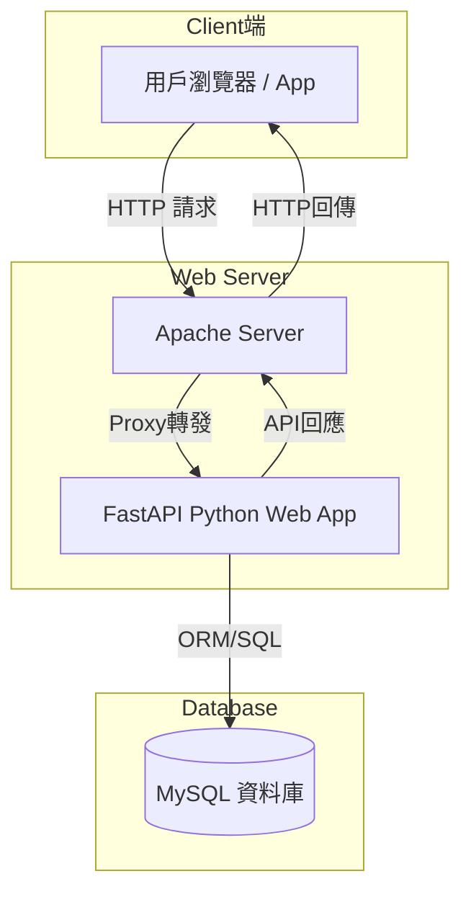

# GoPal

在全球化旅遊市場持續成長的趨勢下，越來越多旅行者希望能找到合適的旅伴，共同探索世界。然而，現有社群媒體與論壇在旅伴匹配方面存在許多瓶頸與痛點，導致使用者難以順利找到理想的同行夥伴，常見問題包括：

1. 缺乏精準匹配機制：現有平台大多僅提供關鍵字搜尋與人工瀏覽方式，缺乏智能匹配功能，使得用戶需要大量篩選資料，耗費時間且匹配成功率低。
2. 旅伴可靠度難以評估：社群媒體通常不提供完整的用戶信用評價機制，導致旅行者無法預先判斷潛在旅伴的可靠性，例如是否準時、是否善於規劃行程、是否適合長時間同行等關鍵因素。
3. 溝通成本高，行程協調困難：現有論壇與社群平台的訊息交流方式過於零散，缺乏即時溝通工具及行程管理功能，導致用戶需要使用多個外部工具來協調旅行計畫，增加複雜度。
4. 旅遊風格與個性篩選不足：大多數平台僅提供一般性標籤（如 #旅遊 #背包客），但無法細分旅遊風格與個性偏好，使得旅行者難以找到真正契合的旅伴。
5. 缺乏安全機制：現有社群媒體未建立身份驗證與風險預防措施，導致旅伴媒合過程可能存在假帳號、詐騙風險或不安全因素。

## 專案目標
為了解決上述問題，本專案開發 GoPal 旅伴媒合平台，透過現代化技術與數據分析能力，提供高效、可靠的旅伴匹配機制，並實現以下目標：
1. 精準旅伴推薦：利用演算法分析用戶的旅遊偏好、行程計畫與社群評價，提升匹配成功率。
2. 建立用戶信任機制：透過信用評分與過往旅伴評價，確保旅伴的可靠性與適合度，降低旅行風險。
3. 提供即時溝通與行程管理工具：內建聊天系統與行程規劃功能，提升溝通效率，簡化旅程協調過程。
4. 個性化旅遊風格匹配：基於旅遊方式、預算、偏好等因子，提供精確篩選選項，確保旅行者能找到真正符合需求的旅伴。
5. 安全驗證與風險控制：採用身份認證與風險警示系統，提升使用者安全性，建立可信賴的媒合平台。

## 技術架構
本系統使用 Apache 作為 Web 伺服器，結合 Python 作為應用層，並以 MySQL 作為後端資料庫。此技術組合可確保系統在高併發請求下維持穩定，並提供：
- 高效能伺服器處理能力，適應大量用戶流量。
- 靈活的應用程式架構，使平台具備快速迭代與擴充性。
- 可靠的數據存儲與管理，確保用戶資料安全性與一致性。


GoPal 旅伴媒合平台致力於解決現有媒合系統的各種痛點，透過技術創新與數據分析，提供智能化、可追溯、可驗證的匹配服務，使旅行者能安心找到合適的旅伴，提升旅行體驗與安全性。



### 啟用資料庫
安裝 MySQL
```
sudo apt update
sudo apt install mysql-server
sudo systemctl start mysql
sudo systemctl enable mysql
```

建立 DB `gopaldb`，設定這個資料庫的預設字元集（character set）為 `utf8mb4`，確保資料庫能正確存取全球多種語言與特殊符號。設定資料庫的預設排序規則（collation）為 `utf8mb4_unicode_ci`，ci 表示不區分大小寫（case-insensitive），例如 a 與 A 被視為相同。
- 排序規則會影響字串比較、排序、LIKE 搜尋等行為。
```sql
CREATE DATABASE gopaldb CHARACTER SET utf8mb4 COLLATE utf8mb4_unicode_ci;
```
建立表在資料庫內
```sql
-- 選擇資料庫
USE gopaldb;

-- 建立表
CREATE TABLE users (
    id CHAR(36) PRIMARY KEY,
    email VARCHAR(255) UNIQUE NOT NULL,
    password VARCHAR(255) NOT NULL,
    name VARCHAR(100) NOT NULL,
    travel_preferences TEXT
);

CREATE TABLE matches (
    match_id CHAR(36) PRIMARY KEY,
    user_id CHAR(36) NOT NULL,
    matched_user_id CHAR(36) NOT NULL,
    destination VARCHAR(255),
    start_date DATE,
    end_date DATE
);

CREATE TABLE messages (
    message_id CHAR(36) PRIMARY KEY,
    sender_id CHAR(36) NOT NULL,
    receiver_id CHAR(36) NOT NULL,
    content TEXT NOT NULL,
    timestamp TIMESTAMP DEFAULT CURRENT_TIMESTAMP
);

CREATE TABLE plans (
    plan_id CHAR(36) PRIMARY KEY,
    user_id CHAR(36) NOT NULL,
    title VARCHAR(255),
    destination VARCHAR(255),
    start_date DATE,
    end_date DATE,
    description TEXT
);

CREATE TABLE reviews (
    review_id CHAR(36) PRIMARY KEY,
    reviewer_id CHAR(36) NOT NULL,
    target_user_id CHAR(36) NOT NULL,
    rating INT,
    comment TEXT,
    timestamp TIMESTAMP DEFAULT CURRENT_TIMESTAMP
);

CREATE TABLE location_reviews (
  id CHAR(36) PRIMARY KEY,
  checkin_id VARCHAR(255),
  reviewer_id VARCHAR(255),
  rating INT,
  comment TEXT,
  created_at TIMESTAMP DEFAULT CURRENT_TIMESTAMP
);

CREATE TABLE checkins (
    id CHAR(36) PRIMARY KEY,
    user_id CHAR(36) NOT NULL,
    location_name VARCHAR(255) NOT NULL,
    latitude DOUBLE NOT NULL,
    longitude DOUBLE NOT NULL,
    timestamp DATETIME NOT NULL DEFAULT CURRENT_TIMESTAMP,
    visibility ENUM('public', 'private') DEFAULT 'public',
    FOREIGN KEY (user_id) REFERENCES users(id) ON DELETE CASCADE
);
```

### 啟用伺服器
啟用必要模組

```
sudo a2enmod proxy
sudo a2enmod proxy_http
sudo a2enmod proxy_wstunnel
sudo a2enmod rewrite
sudo systemctl restart apache2
```
充新啟動
```
sudo systemctl restart apache2
```
`a2ensite` 是 Apache2 的工具指令，用來啟用（enable）一個虛擬主機設定檔（site config），但他會去 `/etc/apache2/sites-available/` 去尋找相關檔案，所以要先把 conf 檔案複製到 `/etc/apache2/sites-available/`內。
```
sudo cp $PWD/fastapi.conf /etc/apache2/sites-available/
```
啟用 site
```
sudo a2ensite fastapi
sudo systemctl reload apache2
```

### 啟動伺服器
```
uvicorn app.main:app --host 127.0.0.1 --port 8000
```

## 如果 uvicorn 確實在運作，但 curl  http://127.0.0.1 一直出現 Apache 的預設頁面（It works!）
> Apache 會以設定檔中 ServerName 和啟用順序判斷回應哪個站台，若有多個在同一端口且 ServerName 衝突，可能導致請求不被正確轉發。所以要停用不必要或預設站台避免衝突。

先停用預設站台 site
```
sudo a2dissite 000-default.conf
sudo systemctl reload apache2
```
再啟用自己的 site 設定
```
sudo a2ensite fastapi
sudo systemctl reload apache2
```
確認 site 狀況
```
sudo apache2ctl -S
```