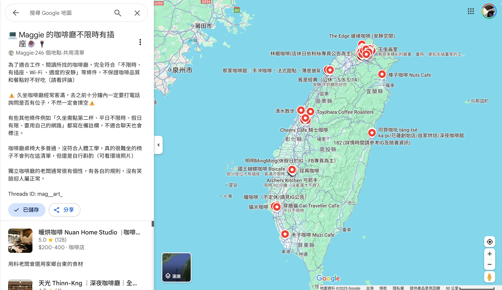

# Google Maps 收藏夾爬蟲

## 專案簡介
本爬蟲程式使用 Selenium 自動化操作 Google 地圖，從指定的收藏夾中擷取店面資訊，包括：
- 店面名稱
- 店面座標（緯度、經度）
- 營業時間
- Google 地圖連結

在本專案用於爬取公開收藏集 [Maggie 的咖啡廳不限時有插座☕️🔌](https://www.google.com/maps/@23.8867444,119.6552845,8z/data=!4m6!1m2!10m1!1e1!11m2!2sgG_1LwZ8Se2fYnqCun_QKw!3e3?entry=ttu&g_ep=EgoyMDI1MDYwNC4wIKXMDSoASAFQAw%3D%3D)，在此感謝作者 Maggie 無私分享自己的愛店。本專案透過此爬蟲程式爬取以下資訊:
- 店家名稱
- 評價與評論數
- 店家圖片
- 地理座標（經緯度）
- Google Maps 連結


---

## 環境需求
- Python 3.8+
- Google Chrome
- ChromeDriver（版本需與瀏覽器對應）

---

## 安裝與設定

1. 安裝 Python 套件
    ```
    pip install -r requirements.txt
    ```
2. 確認 ChromeDriver 可用（建議使用 webdriver-manager 免手動下載）
3. 使用 Chrome 的已登入用戶資料夾，避免重複登入 Google 帳號  
   修改程式中 `user-data-dir` 參數為你本機 Chrome 使用者資料路徑，例如：
    ```python
    options.add_argument("--user-data-dir=C:/Users/你的使用者名稱/AppData/Local/Google/Chrome/User Data")
    ```
---

## 執行方式

1. 修改程式中的收藏夾 URL 為你自己的 Google 地圖收藏夾網址
2. 執行爬蟲程式
    ```
    python crawler/spider.py
    ```
3. 程式會自動擷取店面資料，並輸出結果至終端機或檔案（依程式設計）

---

## 注意事項

- Google 地圖頁面結構可能會變動，若程式無法正常擷取，需更新 CSS selector。
- 請勿大量爬取或短時間內頻繁執行，以免觸發 Google 反爬蟲機制。
- 請遵守 Google 服務條款，不得將資料用於商業或違法用途。
- 建議在非工作時間執行，避免對個人電腦使用造成影響。

## Special Thanks
- Threads ID: mag__art_